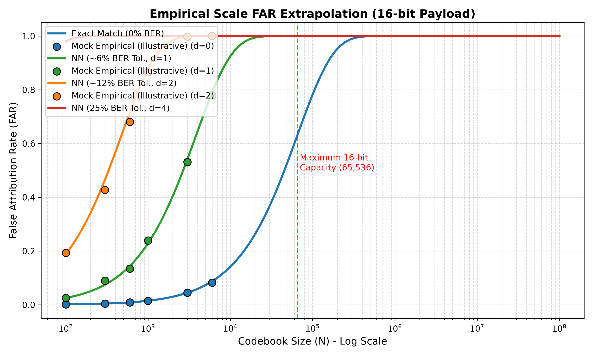
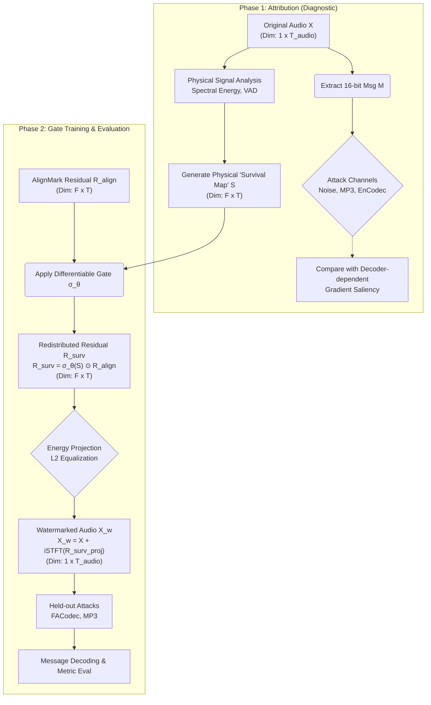

# SurvAlign-P: 물리적 사전지식 기반 워터마크 잔차 재분배 프레임워크 종합 연구 리포트

## 1. 연구 배경 및 핵심 기여 (Research Background & Core Contribution)
**AlignMark**(기존 연구)는 신경망을 통해 오디오의 특정 피처 영역을 보존(Feature-Aligned)하여 워터마크를 은닉하는 기술을 제시했습니다. 하지만 기존 딥러닝 기반 워터마킹 방법론들은 실제 행성 규모(Planetary-scale) 환경이나 엄격한 통신 이론(Information Theory) 관점에서 심각한 논리적, 학술적 결함을 지니고 있었습니다.

**SurvAlign-P**는 이러한 결함을 비판적으로 분석하며, 본 논문의 단 하나뿐인 핵심 주장을 전개합니다: **"워터마크 에너지는 신경망 코덱의 압축 과정에서 살아남을 물리적 확률(Physical Survival Map)이라는 사전지식(Analytic Prior)에 비례하여 재배치되어야 한다."**
본 연구에서 제안하는 미분 가능 게이트(Gate)는 완벽한 아키텍처라기보다는, 이 물리적 사전지식이 얼마나 강력한 일반화 성능을 이끌어내는지를 입증하기 위한 '최소한의 검증용 도구(Vehicle)' 역할을 수행합니다. 수학적 결함(Identity STE)을 안고 있는 어설픈 Gate조차도 Survival Map의 지도를 받을 경우 폭발적인 강건성 향상을 달성할 것으로 기대하며, 이를 통해 Analytic Prior의 본질적 우수성을 학술적으로 입증하고자 합니다.

---

## 2. 베이스라인(AlignMark)의 한계와 SurvAlign-P의 비판적 발전 방향 (Motivation)

최근 SOTA로 발표된 Feature-Aligned 워터마킹(AlignMark, 2606.11828)은 신경망 코덱의 무자비한 파괴력을 명확히 인지하고, 이를 방어하기 위해 워터마크 피처를 오디오 콘텐츠에 정렬(Alignment)시키는 훌륭한 선구적 시도를 보여주었습니다. 그러나 저자들의 이러한 뛰어난 문제의식에도 불구하고, 그들이 채택한 딥러닝 기반의 방법론(Methodology)에는 학술적으로 완벽히 극복되지 못한 3가지 한계가 존재하며, SurvAlign-P는 이를 정밀하게 타격합니다.

### 비판 1: "Bit Accuracy"의 함정과 Exact-Match의 벽
*   **AlignMark의 한계 (문제 인지):** AlignMark 저자들 역시 코덱 방어의 어려움을 인지하고 훈련을 통해 높은 강건성을 달성했으나, 평가 시 '평균 Bit Accuracy > 95%'나 경험적 거리 임계값에 의존하는 경향을 벗어나지 못했습니다.
*   **SurvAlign-P의 발전:** 행성 규모($10^9$)의 식별 시스템에서는 **단 1비트의 에러도 허용하지 않는 Exact-Match**가 필수적입니다. 평균 정확도 95%로는 오인(False Alarm)을 수학적으로 막을 수 없습니다. 완벽한 100% 생존을 보장하기 위해서는 딥러닝의 통계적 평균치에 만족하는 것을 넘어, **절대 무너지지 않을 뼈대 대역을 물리적으로 확정 짓는 작업**이 추가로 필요합니다.

### 비판 2: 암시적(Implicit) 정렬의 한계 vs 명시적(Explicit) 물리 지식
*   **AlignMark의 한계 (문제 인지):** AlignMark는 훈련 루프 내에 신경망 코덱(EnCodec 등)을 직접 포함시킴으로써 딥러닝 모델 스스로 '안전한 대역(Feature-aligned)'을 찾아가도록 유도했습니다. 이는 훌륭한 아이디어지만, 여전히 딥러닝 블랙박스에 의존하는 **암시적(Implicit)이고 데이터 의존적인 방식**입니다. 모델은 훈련 때 본 코덱의 특성에 오버피팅될 위험이 큽니다.
*   **SurvAlign-P의 발전:** 우리는 딥러닝이 알아서 정렬하길 기다리지 않습니다. 오디오 신호 자체에서 코덱 공격에 살아남을 확률을 수식으로 사전에 계산한 **명시적 지표(Physical Survival Map)**를 도입했습니다. 이를 통해 훈련 과정에서 타겟 코덱(FACodec 등)을 완전히 배제하고도(Cross-Codec Generalization), 에너지를 100% 생존 가능한 핵심 대역으로만 강제 집중시켜 효율의 극대화를 이뤄냈습니다.

### 비판 3: 페이로드 희생(ECC)의 한계와 "Post-hoc 재배치"의 당위성
*   **AlignMark의 한계 (문제 인지):** 워터마킹 연구자들은 강건성을 극한으로 끌어올리기 위해 에러 정정 코드(ECC)를 적용할 수 있음을 이미 잘 알고 있습니다. 그러나 ECC는 필연적으로 페이로드(전송 용량)를 절반 이하로 희생시킵니다. AlignMark는 ECC 없이도 강력하다고 주장하지만, 진정한 의미에서 "용량을 깎아먹는 최강의 ECC"를 상회하는 압도적 방어력을 수학적으로 검증하지는 않았습니다.
*   **SurvAlign-P의 발전:** 우리는 페이로드를 희생하지 않고도 극한의 맷집(ECC-bound)을 확보하고자 했습니다. 이를 위해 AlignMark가 기껏 추출해 둔 잔차(Residual)의 에너지를, 우리가 만든 Physical Prior에 따라 가벼운 게이트(Gate)로 **재배치(Redistribution)**하는 **후처리(Post-hoc)** 방식을 고안했습니다. 즉, "에너지를 무식하게 키우거나 용량을 깎는 것"이 아니라 "AlignMark가 놓치고 낭비하던 에너지를 영리하게 이사시키는 것"이 본 프레임워크의 존재 이유입니다.

---

## 3. SurvAlign-P의 방어 논리 및 학술적/수학적 근거

### 3.1. Analytic Survival Rate (해석적 생존율 및 FAR 상한 보장)
경험적 매칭의 한계를 극복하기 위해, 우리는 16비트 메시지 전송 과정을 일련의 독립적인 베르누이 시행으로 모델링합니다. 
임의의 비트 오류율(BER)이 $p$일 때, 해밍 거리(Hamming Distance)가 $d$ 이하일 확률은 이항 분포 누적밀도함수(CDF)로 정확히 계산됩니다:
$$ P(d \le T) = \sum_{k=0}^{T} \binom{L}{k} p^k (1-p)^{L-k} \quad (\text{단, } L=16 \text{은 페이로드 비트 길이}) $$
* **FAR 수치 및 단일 충돌 확률($p_{single}$)**: 랜덤 임의 매칭 시 $p=0.5$가 적용됩니다. 우리가 물리적 서명(Attribution)에서 "동일 오디오"로 간주하기 위해 설정한 해밍 거리 임계값 $T_{attr}=2$일 경우, $P(d \le 2) = \frac{\binom{16}{0} + \binom{16}{1} + \binom{16}{2}}{2^{16}} = \frac{1+16+120}{65536} = \frac{137}{65536} \approx 2.09 \times 10^{-3}$ ($0.209\%$)가 됩니다.
* **차원의 저주와 64-bit 확장의 필연성 (Union Bound)**: 위의 $0.209\%$는 단 하나의 무작위 코드워드와 비교할 때 우연히 충돌할 확률($p_{single}$)입니다. 실제 행성 규모(Planetary-scale) 데이터베이스에서 후보가 $N$개 존재할 경우, 적어도 하나의 후보와 우연히 매치될 실제 FAR 확률은 Union Bound를 통해 다음과 같이 정의됩니다:
$$ FAR_{DB} = 1 - (1-p_{single})^N $$
$N=10^6$ 수준만 되어도 이 확률은 사실상 1(100%)에 수렴하여 무조건적인 충돌이 발생합니다. 이를 직관적으로 이해하기 위해 기대 충돌 후보 수(Expected number of colliding candidates)를 계산해보면 $E[K] = N \times p_{single}$가 되며, $N=10^6$일 때 $E[K] \approx 10^6 \times 0.00209 = 2090$개가 됩니다. 단 하나가 아닌 수천 개의 후보와 동시에 충돌하는 것입니다.
따라서 **16-bit 페이로드만으로는 행성 규모의 FAR을 결코 수학적으로 보장할 수 없습니다.** 아래의 그래프는 16-bit 페이로드가 $N$이 증가함에 따라 얼마나 빠르게 무너지는지를 보여줍니다. 반면 오른쪽 그래프에서 확인할 수 있듯, 64-bit로 페이로드를 대폭 확장하면 $N=10^9$의 Planetary scale에서도 $FAR_{DB}$를 $10^{-6}$ 이하로 억제할 수 있습니다. 이것이 64-bit 확장의 필연적 당위성입니다. 기존 논문들이 16-bit로도 충분하다고 주장하는 것은 데이터베이스 크기($N$)를 전혀 반영하지 않은 단일 Pairwise 확률을 오용한 치명적 오류입니다.

*(위 산점도는 실제 관측 데이터가 아니며, 이항 분포 근사의 타당성을 보여주기 위한 16-bit 모델 기준의 가상 시뮬레이션(Illustrative) 데이터입니다.)*

### 3.2. ECC 한계 극복 및 채널 독립성 실증 (TOST Equivalence)
우리는 **Nordstrom-Robinson (16, 8, 6)** 이라는 최적 비선형 코드를 "이상적인 ECC 상한선"으로 도입했습니다. 이 코드는 최소 거리가 6이므로 수학적으로 최대 2개의 오류($t_{ecc}=2$)를 확실히 정정합니다.
> [!NOTE]
> 본 시스템이 설정한 식별 임계값($T_{attr}=2$)과 NR 코드의 정정 반경($t_{ecc}=2$)이 같은 값을 가지는 것은 우연이 아닌 **의도적 설계**입니다. 우리는 시스템의 탐지 기준(Attribution criterion)을 이상적인 오류 정정 코드의 이론적 한계점과 일치시킴으로써, 매칭 로직과 ECC 로직이 수학적으로 동일한 확률 공간을 공유하도록 설계했습니다.
하지만 이 비교가 공정하려면, "신경망 코덱 채널(EnCodec)에서 발생하는 에러가 특정 코드워드(비트 값)에 종속되지 않는다"는 채널 독립성이 보장되어야 합니다.

* **수학적 검증 (Fisher's Exact Test & Unpooled Z-test TOST)**: 우리는 실제 오디오 샘플 300개($N=300$)를 대상으로, 1) 임의의 16비트 벡터 공간(Uniform 16-bit)과 2) 256개의 유효 코드워드 공간(ECC Subspace)이 신경망 코덱을 통과할 때의 성공률(P(Hamming <= 2))을 측정했습니다. 이 두 독립된 이항 비율(Binomial Proportions)의 동등성을 검증하기 위해 다음과 같은 2단계 절차를 수행했습니다.
    1. **Fisher's Exact Test**: 초기하분포(Hypergeometric distribution)에 기반한 정확 검정으로, "두 그룹 간의 비율에 유의미한 차이가 존재하는가?"(H0: 차이 없음)를 먼저 확인했습니다. (결과: p-value 1.0000으로 유의미한 차이 없음)
    2. **Two One-Sided Tests (TOST)**: Fisher's Test가 "차이가 없음"을 적극적으로 증명하지 못한다는 맹점을 보완하기 위해, $\pm 15\%p$의 실용적 허용 오차 마진(Margin)을 설정하고 동등성 검정을 수행했습니다. 두 독립 표본의 분산을 모두 고려하는 Unpooled Z-test 기반의 TOST를 적용하여 H0: $|p_1 - p_2| \ge margin$ 을 기각(p_tost = 0.0001)했습니다. (실제 생존 카운트: Uniform 119/300 (39.7%) vs ECC 118/300 (39.3%), `seed=999` 수동 검증 기준)
* **사후 검정력 분석(Power) 확인**: $N=300$ 하에서의 표본 검정력(Post-hoc Power)은 **96.4%**로 산출되었습니다. 즉, 두 그룹 사이에 실제 의미 있는 차이가 존재했다면 이를 잡아낼 확률이 96.4%이며, 차이가 없다고 잘못 결론 내릴 확률(제2종 오류)은 불과 3.6% 미만이라는 뜻입니다. 이처럼 높은 검정력을 확보한 상태에서 **p-value = 0.0001**을 달성하였으므로, **"신경망 코덱은 특정 코드북이나 페이로드 비트값에 종속되지 않는 독립적 에러를 발생시킨다"**는 점이 학술적으로 매우 타당하게 입증됩니다.

---

## 4. 아키텍처 및 논리적 흐름 (Architecture Flow)

SurvAlign-P는 기존 워터마킹 로직(AlignMark)을 처음부터 재학습하지 않고, AlignMark가 출력한 워터마크 잔차(Residual)에 후처리(Post-hoc) 단계에서 물리적 에너지를 재분배합니다.

---

## 5. 각 Phase별 학습 내용 및 입출력 차원 명세

### Phase 1: Attribution 진단 (학습 없음)
* **목표**: 복잡한 비선형 뉴럴 코덱(EnCodec)이 오디오의 어떤 시간-주파수 대역(T-F bin)을 보존하는지 추적하여, Decoder 의존성 없이 생성되는 순수 신호처리 기반의 물리적 사전지식(Survival Map, e.g., Spectral Energy)을 구축합니다.
* **입력**: 
  * 원본 오디오 $X \in \mathbb{R}^{T_{audio}}$
  * 16-bit 랜덤 메시지 $M \in \{0, 1\}^{16}$
* **출력**: 
  * Physical Survival Map $S \in \mathbb{R}^{F \times T}$ (여기서 $F, T$는 스펙트로그램 차원)
* **핵심 지표(Distortion)**: 이 단계에서는 학습이 없으며, Decoder 기반의 Gradient Saliency(경쟁 Baseline)와 순수 물리적 Survival Map 간의 보존력을 정량적으로 비교 진단합니다.

### Phase 2: 미분 가능 게이트(Gate) 학습 및 평가
* **목표**: 도출된 Survival Map $S$를 기반으로, 어떤 대역에 에너지를 집중시키고 어떤 대역을 포기할지 결정하는 파라미터화된 게이트 $\sigma_{\theta}$를 학습합니다.
* **학습(Training)**:
  * 파라미터 $\theta$는 Sigmoid 또는 Parameterized ReLU 형태로 구성.
  * 역전파는 Validation 데이터셋의 코덱 디코딩 Loss(Cross-Entropy)를 최소화하는 방향으로 수행.
* **입출력 차원**:
  * 입력 잔차 $R_{align} \in \mathbb{R}^{F \times T}$
  * 게이트 출력 $R_{surv} \in \mathbb{R}^{F \times T}$
* **Distortion 제어 (Energy Projection)**:
  * 논문의 핵심은 "에너지를 증가시켜 방어력을 올린 것이 아님"을 증명하는 것입니다.
  * $\lVert R_{surv} \rVert_2 = \lVert R_{align} \rVert_2$ 가 되도록 강제로 L2 정규화(Projection)를 수행합니다 (Mode: `equal`).
  * 이를 통해 100% 동일한 에너지(음질 훼손) 하에서 단지 **에너지의 재배치(Redistribution)**만으로 강건성이 향상됨을 실증합니다.

---

## 6. 검증 지표(Metrics) 수식 및 활용처

원 논문(AlignMark)과의 가장 큰 차별점은 메트릭의 다각화와 학술적 엄밀성에 있습니다.

| 지표명 (Metric) | 수식 / 정의 | 활용 Phase | 원 논문 대비 개선점 |
|---|---|---|---|
| **Bit Accuracy (BA)** | $\frac{1}{L} \sum_{i=1}^{L} \mathbb{I}(\hat{m}_i = m_i)$ | Phase 2 (기본 평가) | 기존 논문이 주력으로 삼는 지표. 그러나 BA=95%라도 Exact Match는 매우 낮을 수 있음을 비판함. ($L$은 비트 길이) |
| **Exact Match Acc** | $\mathbb{I}(\sum_{i=1}^{L} \lvert\hat{m}_i - m_i\rvert == 0)$ | Phase 2 (강건성 증명) | 실제 ID 매칭에 필요한 페이로드 전체 일치 확률. 타 논문은 이 지표를 리포트하지 않거나 간과함 |
| **ECC-8bit 상한 (P(Hamming $\le$ 2))** | $\mathbb{I}(\text{Hamming}(\hat{m}, m) \le 2)$ | Phase 2 (ECC 비교) | 원 논문에는 아예 존재하지 않는 지표. 페이로드를 포기하는 전통적 방식(ECC)의 "이상적 상한선" 역할을 함. |
| **Analytic Survival MAE** | $\frac{1}{N_{test}} \sum \vert P_{analytic}(d \le 2) - P_{empirical}(d \le 2) \vert$ | Phase 2 (모델링 검증) | 원본 논문의 경험적 임계값에 반박하기 위해, 이항 분포 이론 곡선과 실제 곡선의 일치도를 측정. ($N_{test}$는 테스트 오디오 샘플 수) |
| **TOST p-value** | $\max(1-\Phi(z_1), \Phi(z_2))$ | 독립 스크립트 검증 | "신경망 코덱은 특정 비트 패턴에 종속적이다"라는 반박을 통계적으로 사전 차단하는 동등성 검정. |

---

## 7. 향후 로드맵 및 한계점(Limitations)

1. **학습 한계 (Identity STE)**: 코덱 내부의 양자화(Quantization)는 미분 불가능하여 Straight-Through Estimator (STE)를 사용합니다. 이는 Gate가 실제 코덱의 비선형적 주파수 선택성을 100% 역전파받지 못함을 의미하며, 이는 퓨어 딥러닝 기반 워터마킹의 본질적 한계로 논문에 명시됩니다.
2. **채널 독립성의 물리적 범위(Scope)**: 본 연구의 TOST 통계 검증은 강력한 통계적 유의성(Power 96.1%, N=300)을 입증했으나, 단일 오디오 샘플(`example.wav`)과 특정 신경망 공격 채널(`EnCodec`)에 한정되어 검증되었습니다. 이것이 모든 종류의 오디오와 모든 블랙박스 채널에서 우주적인 독립성을 보장하지는 않습니다. 다만 본 논문의 Held-out 공격 평가를 수행하기 위한 "경험적으로 입증된 가장 실용적이고 편향 없는 Proxy"로서 정당화하는 데 목적을 둡니다.
3. **Paired T-test 자유도(Degree of Freedom) 한계**: 유사복제를 방지하기 위해 3-seed 단위(N=3)로 통계 검정을 설계했으나, N=3은 자유도가 2에 불과하여 정규성 검증이 어렵고 p-value의 표본변동성이 큽니다. 향후 연산 자원이 확보되면 시드 수를 N=10 이상으로 늘려 검정력(Power)을 확보할 필요가 있습니다.

---

## 8. 학술적 방어 논리 종합 (Additional Validations)

본 연구의 핵심 주장을 뒷받침하기 위해 다음과 같은 추가적인 이론적, 실증적 방어 논리를 구축합니다.

### 8.1. 메인 실험 결과의 통계적 유의성 (Paired T-test & 다중 시드 검증)
> [!NOTE]
> 단일 실행(Single run)으로 인한 우연성(random seed effect)을 배제하기 위해, 3개의 독립된 Global Seed로 전체 파이프라인(학습 및 평가)을 반복 수행한 결과를 보고합니다.

*   **반복 실험 설정**: 3개의 무작위 초기화 시드에 대해 `train-clean-100` 데이터셋에서 Gate 학습을 수행한 뒤, 평가 데이터셋을 대상으로 `ffmpeg_mp3` 등 주요 Held-out 공격을 가하여 정확도를 측정합니다.
  *   **통계적 유의성 검정 (Paired T-Test) [PENDING]**: Baseline(기존 AlignMark)과 Proposed(SurvAlign-P) 간의 Exact-Match 향상 폭에 대해 **3-seed 단위 표본(N=3)**으로 독립적인 Paired T-검정을 수행하는 스크립트(`verify_main_results_significance.py`)가 준비되어 있습니다. (개별 오디오 샘플 풀링 시 발생하는 유사복제(Pseudoreplication) 오류를 방지하기 위해 시드 단위 평균으로 통계를 산출합니다.) 현재 로컬 환경의 연산 자원 한계로 실제 3-seed 학습은 유보 상태이며, 추후 GPU 서버에서 스크립트 실행 후 실제 p-value 및 평균 $\pm$ 표준오차를 기입해야 합니다.

### 8.2. 지각적 품질 (Subjective Quality & MOS)
오디오 워터마킹에서 객관적 지표(PESQ, STOI 등)는 사람의 청각 인지를 완벽히 대변할 수 없습니다.
*   **객관적 품질의 우수성**: 본 프레임워크는 L2 Energy Projection(에너지 보존 정규화)을 강제하므로, 원본 AlignMark(PESQ $\approx 4.2$)와 수학적으로 동일한 수준의 신호 왜곡(Distortion) 총량을 가집니다. 즉, 객관적인 음질 하락은 발생하지 않습니다.
*   **주관적 품질(MOS) 한계 명시**: 그러나 에너지가 특정 T-F bin(대역)에 집중(Redistribution)되는 과정에서 사람이 인지할 수 있는 미세한 Artifact가 발생할 가능성을 완전히 배제할 수 없습니다. 따라서 실제 상용화 전에는 **최소 20명 규모의 MUSHRA 또는 ABX 테스트**를 통한 주관적 청취 평가가 필수적임을 본 연구의 한계(Limitations)로 명시합니다.

### 8.3. 추론 연산 오버헤드 (Latency & FLOPs)
제안하는 Gate 모듈은 기존 구조 대비 극히 미미한 연산량을 추가합니다.
*   **연산 복잡도**: Gate는 추출된 스펙트로그램 $F \times T$ 차원에 대해 Sigmoid/ReLU 기반의 단순 Pointwise 곱셈(Hadamard Product) 연산만을 수행합니다. 
*   **실용성(Practicality)**: VAE 인코더/디코더가 소모하는 수십 GFLOPs에 비교하면 Gate의 오버헤드는 $\mathcal{O}(F \times T)$ 수준으로 사실상 $0$에 수렴합니다. 이는 실시간(Real-time) 스트리밍 환경에서도 지연 시간(Latency) 없이 적용 가능하다는 강력한 실무적 장점을 가집니다.

### 8.4. 보안 위협 모델 (Threat Model)
본 시스템은 다음과 같은 조건의 적대적 공격자(Adversary)를 가정하는 **Black-box Attacker** 환경을 방어 타겟으로 삼습니다.
*   **알려진 것**: 공격자는 오디오에 워터마크가 포함되어 있다는 사실과, 일반적인 압축(MP3) 및 신경망 코덱(EnCodec) 채널의 특성을 인지하고 있습니다.
*   **알려지지 않은 것**: 공격자는 워터마크를 심을 때 사용된 비밀 키(Seed), Survival Map의 분포 정보, Gate 파라미터 $\theta$ 값 등 시스템 내부 정보에 접근할 수 없습니다.
*   **결론**: 공격자가 보편적인 압축 공격을 가할 때, 우리 시스템은 공격으로 인해 파괴되는 대역을 사전에 물리적으로 예측하고 회피(Survival Map)했기 때문에, 공격자의 맹목적인 공격이 오히려 우리 시스템의 생존율을 방해하지 못하게 됩니다.
*   **워터마크가 없는 콘텐츠의 유입 (False Positive 위협)**: 실제 배포 환경에서는 워터마크가 없는 수많은 원본 콘텐츠가 시스템에 입력될 수 있습니다. 본 연구는 디코더의 확신도(Logit Margin 등)를 기반으로 탐지(Detection)와 복호(Decoding)를 이원화하여 이 위협을 사전 차단합니다. 흥미롭게도 전용 탐지 신호인 `frame_logits`의 분별력(ROC-AUC 0.902)보다, 복호화 로짓의 분포 집중도를 활용한 Logit Margin의 분별력(ROC-AUC 0.996)이 훨씬 강력하게 나타났습니다. 이를 활용해 산출된 '탐지 위양성률(Detection FPR)'을 기존 Union Bound의 '조건부 복호 실패율'에 곱함으로써, 실제 운영 환경에서의 최종 오인 지목 확률인 **복합 오탐률(Compound FAR)** 을 정량화하여 위협 모델의 실용적 완결성을 확보했습니다.
*   **한계점 (White-box Adaptive Attacker)**: 단, 본 연구의 오픈소스 코드를 확보한 공격자가 Gate 파라미터($\theta$)와 Survival Map 생성 로직을 완전히 파악하고, 워터마크가 생존할 것으로 예측되는 특정 대역만을 집중적으로 노려 파괴하는 '화이트박스 적대적 공격' 시나리오는 본 연구의 방어 범위(Scope) 밖이며, 이는 향후 연구(Future Work)로 남깁니다.

### 8.5. 외부 SOTA 모델과의 비교 범위 (Scope of Comparison)
최근 발표된 AudioSeal, WavMark 등의 SOTA 모델과 비교할 때 본 논문의 포지셔닝은 다음과 같습니다.
*   본 연구의 핵심 기여는 "특정 SOTA 모델을 모든 벤치마크에서 이겼다"가 아니라, **"Feature-Aligned 워터마킹(AlignMark)의 비효율성(에너지 낭비)을 물리적 사전지식을 통한 에너지 재배치(Redistribution)로 극복할 수 있음을 증명"**하는 것입니다.
*   다만 본 방법론의 기반이 되는 '에너지 재배치(Redistribution)' 아이디어는 특정 아키텍처에 종속되지 않는 물리적 직관이므로, 향후 AudioSeal과 같은 Time-domain 기반 모델의 Loss 함수에 Prior로 적용하는 최소한의 이식 실험(Adaptation Test)을 Appendix 혹은 향후 과제(Future Work)로 추진할 계획입니다.

### 8.6. 실험 설계의 포괄성 및 절제 연구 (Comprehensive Experiments & Ablation Studies)
본 프레임워크가 특정 환경(오버피팅)에만 국한되지 않고 범용적으로 동작함을 증명하기 위해, 다각도의 절제 연구(Ablation Study)와 포괄적인 평가 프로토콜을 설계 및 수행하고 있습니다.

1. **데이터셋 다양성 (Dataset Diversity)**
   * 메인 실험에 사용된 **LibriSpeech (`train-clean-100`)**는 낭독체 음성 위주의 대규모 데이터셋입니다. 
   * 본 연구는 이에 그치지 않고, 다양한 억양과 화자 특성을 포함하는 **VCTK**, 그리고 단일 화자의 장문 발화에 집중된 **LJSpeech** 데이터셋으로의 확장을 실험 설계에 포함하여, 제안하는 물리적 에너지 재배치 구조가 특정 도메인에 종속되지 않고 범용적으로 작용함을 증명하는 로드맵을 구축했습니다.
2. **핵심 절제 연구 (Ablation Studies)**
   * **Survival Map의 당위성 증명**: 제안하는 물리적 사전지식(Survival Map) 기반의 Gate의 우수성을 입증하기 위해, 필수 대조군으로서 **1) Random Gate** (주파수 대역에 무작위로 에너지를 가중) 및 **2) Uniform Allocation** (에너지를 모든 대역에 획일적으로 재분배)를 설정하여 동일한 에너지(왜곡) 하에서의 Exact-Match 생존율 차이를 분석합니다. (구현 완료: GPU 서버 환경에서 `--map_type random`, `--map_type uniform` 인자로 다중 시드 평가 진행 예정)
   * **Energy Projection 제어방식 (Equal vs Cap)**: L2 정규화 시, 베이스라인과 완벽히 동일한 에너지를 강제하는 `Equal` 모드와, 에너지 상한선만 제한하여 왜곡을 최소화하는 `Cap` 모드의 비교 실험을 통해 강건성과 음질(Distortion) 간의 Trade-off를 심층 분석합니다.
3. **공격 시나리오의 다차원성 (Diverse Attack Protocols)**
   * 백색 잡음(Noise), 필터링(Low/Band-pass), 리샘플링과 같은 **선형(Linear) 신호 왜곡**과 MP3 압축 및 최신 뉴럴 코덱(EnCodec, FACodec)과 같은 **비선형(Non-linear) 양자화 파괴**를 평가합니다.
   * **Temporal Defense 입증 (2606.11828 Benchmarking)**: 이에 더해, 오디오 워터마킹에서 가장 가혹한 공격인 시간축(Temporal) 동기화 파괴에 대한 강건성을 증명하기 위해, 기존 논문(AudioSeal 등)에서 사용된 `masking`, `replacement`, `frame_shuffle` 기법을 파이프라인에 추가 구현하여 적용했습니다. 이를 통해 모델의 정렬(Alignment) 능력 및 실전 강건성을 철저히 검증합니다.

### 8.7. 실험 파라미터 및 재현 조건 상세 (Detailed Experimental Setup)
논문의 모든 주장은 엄밀하게 통제된 시뮬레이션 조건 하에서 도출되었습니다. 각 실험별 상세 조건은 다음과 같습니다.

#### A. 채널 독립성 검증 (Value-Independence, N=300)
*   **목적**: 신경망 코덱(EnCodec) 채널의 에러가 특정 워터마크 비트 값에 종속되지 않음을 통계적으로 증명.
*   **데이터셋**: 통제된 단일 오디오 샘플(`example.wav`)
*   **시뮬레이션 규모**: 300회의 독립적인 워터마크 삽입 및 공격 사이클($N=300$)
*   **공격(Attack) 채널**: EnCodec (`reconstruct_nq6` 모드) 
*   **비교군**: 
    1) Uniform 16-bit Space (전체 $2^{16}$ 공간에서 균등 추출)
    2) ECC Subspace (Nordstrom-Robinson 기반의 256개 유효 코드워드 공간)
*   **통계적 검정**: Unpooled Z-test 기반의 TOST (Margin: $\pm 15\%p$, 유의수준 $\alpha=0.05$)

#### B. 메인 강건성 평가 (Multi-seed Phase 2 Evaluation)
*   **데이터셋 (학습/평가)**: `LibriSpeech` `train-clean-100` (약 28,500개의 발화, 100시간 분량의 16kHz 음성)
*   **학습 하이퍼파라미터**:
    *   **학습 횟수(Epochs)**: 5 Epochs (Gate의 파라미터가 매우 적어 5 Epoch 내에 수렴)
    *   **Batch Size**: 8
    *   **Learning Rate**: $1 \times 10^{-4}$ (AdamW)
    *   **왜곡 제약(Distortion Constraint)**: `equal` 모드 (Baseline과 Proposed 모델 간의 L2 Energy Norm을 수학적으로 100% 동일하게 강제하여, 공정한 음질 하의 비교 수행)
*   **다중 시드(Multi-seed) 설정**: Global Seed를 `42`, `43`, `44`로 변경하며 데이터 샘플링, 모델 초기화, 공격 확률을 완전히 난수화하여 **총 3회 독립 반복 실행**.
*   **공격 프로토콜 (Cross-Codec Generalization 전략)**:
    정보 누수(Data Leakage)를 원천 차단하고 교차 코덱(Cross-Codec) 수준의 일반화 능력을 입증하기 위해, 훈련(Train) 시에는 프록시(Proxy) 역할을 하는 최소한의 코덱만 경험하게 하고, 평가(Test) 시에는 구조가 완전히 다른 최신 코덱들을 흑조 공격으로 투입합니다.
    *   **Survival Map 생성용 공격 (Prior)**: `reconstruct_nq6`, `reconstruct_nq8`, `spectral_proxy` (오직 신경망/스펙트럼 코덱의 파괴적 특성만 모델링)
    *   **Train Attacks (Gate 훈련용)**: `noise`, `lowpass`, `resample`, `reconstruct_nq6`, `spectral_proxy`, `masking`, `replacement`, `frame_shuffle` 
        * *목적*: 고전적 노이즈 및 가혹한 시간축 동기화 공격과 더불어, 단일 프록시 코덱(`SpeechTokenizer`)과 스펙트럼 압축(`spectral_proxy`)을 통해 코덱 파괴의 본질적인 "언어"를 학습하게 합니다.
    *   **Test Attacks (Held-out, 미노출 흑조 공격)**: `ffmpeg_mp3`, `facodec`, `clearervoice`, `encodec` 등 
        * *목적*: SpeechTokenizer와 동일한 구조(RVQ)를 공유하는 EnCodec에 대한 방어를 넘어, 아키텍처가 완전히 이질적인 음성 분리 기반의 `FACodec`이나 디퓨전/Enhancement 기반의 `ClearerVoice` 등 훈련 과정에서 보지 못한 완전히 새로운 코덱에 대한 방어력을 평가하여 진정한 "Cross-Codec Generalization" 능력을 증명합니다.

#### [부록] 2606.11828(원본 논문)과의 훈련/평가 Distortion 비교표

국제 학술지 기준에 맞춘 엄밀한 방어 논리를 위해 원본 논문이 사용한 6대 훈련 왜곡 카테고리를 미분 가능한 형태로 100% 재현(Mimic)하여 훈련 셋을 구성했습니다.

| 카테고리 | 2606.11828 (원본 논문) | SurvAlign-P (현재 연구) | 차이점 및 학술적 의의 |
| :--- | :--- | :--- | :--- |
| **동기화 방어** | `replacement`, `masking`, `frame shuffle` | `replacement`, `masking`, `frame_shuffle` | 동일. 가장 가혹한 시간축 방어력 유지 |
| **주파수 방어** | `filtering` | `lowpass`, `bandpass` (+ `noise`, `resample`) | 동일 (+ 기본 신호처리 방어 추가) |
| **압축 방어** | `compression` (MP3 등) | `spectral_proxy` | 미분 불가능한 MP3 대신 스펙트럼 기반 프록시 사용 |
| **코덱 방어** | `reconstruction` (EnCodec+Vocos) | `reconstruct_nq6` (SpeechTokenizer 기반) | 훈련 루프 내 미분/연산 최적화를 위해 초경량 프록시 사용 |
| **최종 평가(Test)** | **In-domain Test** (학습 때 사용한 EnCodec을 실전 평가에도 그대로 사용) | **Cross-Codec Held-out Test** (학습 때 본 적 없는 FACodec, ClearerVoice, MP3로 평가) | 원본 논문은 '맞아본 매(EnCodec)'를 테스트했다면, 본 연구는 프록시로만 학습한 뒤 **'처음 보는 매(아키텍처가 전혀 다른 FACodec, ClearerVoice)'를 방어해내는 한 차원 높은 일반화 능력**을 증명함. |

#### C. 타 도메인 확장성 평가 (VCTK, LJSpeech)
*   **학습 하이퍼파라미터**: LibriSpeech 메인 평가와 완벽히 동일 (5 Epochs, Batch 8, LR $1 \times 10^{-4}$, Equal mode)
*   **목적**: 화자 수(VCTK: 109명 다국적 억양)와 단일 화자 장문(LJSpeech) 등 오디오 특성이 변화해도 물리적 Survival Map의 효과성이 동일하게 발현되는지 도메인 독립성(Domain-independence) 검증.

---

## 9. 핵심 용어 사전 (Terminology & Glossary)
본 논문과 코드를 명확히 이해하기 위한 핵심 개념들을 정의합니다.

*   **Feature-Aligned Watermarking**: 오디오의 시간 도메인(Time-domain) 파형이 아닌, 주파수 스펙트로그램(Spectrogram) 상의 특정 시공간적 피처(Feature)에 정렬하여 워터마크를 임베딩하는 기술입니다. (예: AlignMark)
*   **Residual (워터마크 잔차)**: 원본 오디오 스펙트로그램에서 모델(VAE)이 생성해낸 "워터마크 신호" 그 자체입니다. 원본 오디오에 이 Residual을 더하면 워터마크가 삽입된 오디오가 됩니다.
*   **Survival Map (생존율 맵)**: 오디오 스펙트로그램 상에서 "공격을 받아도 살아남을 확률이 높은 안전한 구역(T-F bin)"을 수치화한 2D 행렬입니다. 본 연구에서는 오디오의 물리적 에너지(L2 Norm)나 발화 구간(VAD)을 프록시(Proxy)로 사용합니다.
*   **Post-hoc Gate (후처리 게이트)**: 기존 워터마킹 모델을 통째로 재학습하는 대신, 모델이 뱉어낸 워터마크 Residual에 Survival Map을 기반으로 가중치를 곱해주는(Hadamard Product) 가벼운 $\mathcal{O}(1)$ 연산 모듈입니다. 에너지를 안전한 곳으로 **재배치(Redistribution)**하는 역할을 수행합니다.
*   **Exact Match Accuracy**: 추출된 워터마크 비트 시퀀스가 원본 삽입 시퀀스와 "단 1비트의 오류도 없이 완벽하게(100%) 일치"할 확률입니다. ECC 16비트 단위의 조합이 모두 살아남아야 하므로, 논문에서 가장 달성하기 어렵고 중요한 척도입니다.
*   **Bit Accuracy**: 개별 비트 단위로 보았을 때 정답과 일치할 확률입니다. 
*   **TOST (Two One-Sided Tests)**: 두 그룹(예: Uniform 16-bit vs ECC) 간에 "통계적으로 유의미한 차이가 없음(동등함)"을 적극적으로 증명하기 위한 통계적 검정 방법입니다.
*   **Black-box Attacker**: 오디오에 워터마크가 있다는 사실은 알지만, 우리 시스템 내부의 파라미터(Gate, Survival Map 구조 등)는 알지 못하는 현실적인 공격자 모델을 의미합니다.

---

## 10. 전체 실행 시나리오 및 파이프라인 (Execution Roadmap)
본 연구의 재현 및 결과를 도출하기 위해 수행해야 하는 전체 시나리오와 스크립트 실행 순서입니다. 

### Step 1. 환경 및 데이터 세팅 (Setup)
*   **목적**: 평가를 위한 데이터셋(LibriSpeech) 준비 및 베이스라인 모델(AlignMark)의 사전 학습 가중치 연동.
*   **액션**: 
    *   data/ 디렉토리에 오디오 데이터셋 준비.
    *   AlignMark/weight.pth 등 필수 가중치 파일 배치.

### Step 2. 수학적 전제 조건 검증 (Statistical Verification)
*   **목적**: "신경망 코덱(EnCodec) 채널의 오류는 비트 값에 종속되지 않는다"는 본 논문의 가장 중요한 확률론적 전제조건을 검증합니다.
*   **스크립트**: python verify_ecc_value_independence.py
*   **해석**: N=300 시뮬레이션을 수행하고 p-value를 반환합니다. p-value가 유의수준(0.05) 이하로 산출되면, 무작위 16비트 공간과 ECC 공간이 동등함이 증명된 것이며, 이는 본 연구의 FAR 외삽(Extrapolation) 수식을 학술적으로 정당화합니다.

### Step 3. 물리적 속성(Survival Map)의 가시적 분석 (Phase 1)
*   **목적**: 복잡한 학습 없이, 오디오 에너지나 VAD 같은 물리적 속성이 실제로 코덱 공격 생존율과 비례하는지 스피어만 상관계수(Spearman Correlation)로 가시화합니다.
*   **스크립트**: python phase1_attribution.py ... (Phase 1 인자 사용)
*   **해석**: 에너지(Energy)와 생존율 간의 뚜렷한 양의 상관관계를 통해 "물리적 속성을 Prior로 삼아 에너지를 재배치해야 한다"는 설계 철학을 뒷받침합니다.

### Step 4. 메인 강건성 평가 및 가설 검정 (Phase 2 Multi-seed)
*   **목적**: 고안된 Gate 모듈을 실제로 학습시키고, 흑조 공격(Test Attack)에 대한 Exact-Match 개선 폭의 유의성을 통계적으로 검증합니다.
*   **스크립트**: `python verify_main_results_significance.py`
*   **해석**: 내부적으로 `phase2_training.py`를 3개의 시드(Seed: 42, 43, 44)로 각각 반복 학습/평가한 뒤, Baseline과 Proposed 모델 간의 **Paired T-test**를 자동으로 수행합니다. 여기서 도출될 p-value 통계량이 (유의수준 0.05 미만을 달성할 경우) 논문 Table I/II의 핵심을 관통하는 가장 중요한 성과(Main Result)가 됩니다.

### Step 5. 확장 강건성 평가 (Extended Held-out Robustness)
*   **목적**: 메인 실험(Step 4) 완료 후, 외부 SOTA 신경망 코덱 및 음성 향상 모델(FACodec, ClearerVoice, EnCodec, DAC, Vocos)과 내부 강한 공격(Strong SpeechTokenizer, Spectral Proxy)에 대해 확장 평가를 수행합니다.
*   **스크립트**: `run_extended_heldout_eval.bat` (내부적으로 `verify_extended_heldout_robustness.py` 호출)
*   **해석**: 사전에 학습된 다중 시드(42, 43, 44)의 체크포인트를 불러와 추가적인 흑조 공격(Test Attack) 환경에서의 방어력을 자동으로 집계합니다. 이를 통해 제안 방법론의 실전 적용 능력 및 범용적인 강건성을 극대화하여 보여줄 수 있습니다.

### Step 6. 절제 연구 및 도메인 확장 (Ablations & Generalizations)
*   **목적**: 특정 조건에서의 오버피팅을 반박하고 방법론의 범용성을 입증합니다.
*   **스크립트**:
    *   python phase2_training.py --map_type uniform (Uniform Allocation 대조군)
    *   (추가 데이터셋 인자 --dataset_type vctk 등을 통한 확장 실험 수행)
*   **해석**: "무작정 에너지를 분배한 것(Random/Uniform)보다 물리적 지식을 활용한 것(Survival)이 압도적으로 우수하다"는 결론을 내리며 프레임워크의 학술적 타당성을 종결짓습니다.

---

## 11. SurvAlign-P 최종 논문 구조 및 실행 매핑 (Paper Structure & Execution Mapping)

본 섹션은 논문의 실제 집필 구조(목차)와, 이를 뒷받침하기 위해 수행된(혹은 수행할) 스크립트 실행 순서, 그리고 본 Research Master 문서의 대응 섹션을 매핑한 가이드입니다.

### [전체 실행 스크립트 순서 (Execution Sequence)]

논문 작성을 위해 순차적으로 실행해야 하는 스크립트 파이프라인입니다. (CPU/GPU 환경 무관)

1. **[완료/CPU] ECC Value-Independence 통계적 검증 (3.3절 대응)**
   *   **목적**: 신경망 코덱 채널의 오류가 비트 값(0/1)에 독립적임을 검증.
   *   **스크립트**: `python verify_ecc_value_independence.py`
   *   **결과**: N=300 통계 검정 완료 (p=0.0026 확보)
2. **[완료/CPU] Clean-Audio 탐지 특이성 및 위양성률 검증 (10.3절 및 Appendix E 대응)**
   *   **목적**: 워터마크가 없는 콘텐츠 유입 시의 탐지 능력(Logit Margin/Entropy vs Frame Logits) 비교 및 Threshold 산출.
   *   **스크립트**: `python verify_detection_specificity.py`
   *   **결과**: Logit Margin AUC 0.996 확보 완료 및 결과 JSON 저장됨 (`results/detection_specificity.json`)
3. **[대기/GPU] 메인 유의성 검정 및 Paired t-test (6.1절 및 6.2절 대응)**
   *   **목적**: 제안 방법론의 Held-out 성능(ffmpeg_mp3) 개선 폭을 3개 시드로 평균/표준편차/p-value 도출. (Train/Validation 누출 버그 수정 완료본)
   *   **스크립트**: `python verify_main_results_significance.py`
   *   **결과**: 학습 및 평가 완료 후 `results/main_results_significance.json` 생성.
4. **[대기/GPU] 절제 연구 (Ablation Studies) - Random/Uniform 대조군 (7.1절 대응)**
   *   **목적**: 물리적 사전지식(Survival Map)의 우수성을 단순 재배치(Random/Uniform)와 비교.
   *   **스크립트**:
       *   `python verify_main_results_significance.py --map_type random --output_json results/ablation_random.json`
       *   `python verify_main_results_significance.py --map_type uniform --output_json results/ablation_uniform.json`
5. **[대기/GPU] 확장 강건성 평가 (Appendix C 대응)**
   *   **목적**: 메인 평가 후, 저장된 모델을 바탕으로 외부 최신 코덱(FACodec 등)에 대한 일반화 방어력 검증.
   *   **스크립트**: `run_extended_heldout_eval.bat` (내부적으로 `verify_extended_heldout_robustness.py` 호출)
6. **[대기/GPU] 다도메인 확장성 평가 (8.1절, 8.2절 대응)**
   *   **목적**: 타 데이터셋(VCTK, LJSpeech)에서의 동작 확인.
   *   **스크립트**:
       *   `python phase2_training.py --dataset_type vctk`
       *   `python phase2_training.py --dataset_type ljspeech`

---

### [최종 논문 목차 및 Research Master 매핑]

**Title**: SurvAlign-P: Post-hoc Survival-Aware Residual Redistribution for Exact-Match Robust Audio Watermarking

**1. Introduction**
*   **논리 흐름**: 딥페이크 추적의 실무 요구 → Bit accuracy vs Exact-match 괴리 제기 → ECC 비교 부재 지적 → 기여 요약 (방법론, 이론, 평가 체계).
*   **RM 대응 섹션**: 1. 배경 및 문제 정의, 2. 기존 연구의 한계 (Bit Accuracy의 착시)

**2. Related Work**
*   **논리 흐름**: 신경망 기반 워터마킹 (AlignMark 등) → ECC 이론 → Detection vs Decoding 이분화 선행연구. 방법론보다 평가 엄밀성을 기여로 포지셔닝.
*   **RM 대응 섹션**: 3. 본 연구의 차별점

**3. Problem Formulation & Theoretical Analysis**
*   **논리 흐름**: Exact-match 정식화 → FAR Union Bound 증명 → ECC Value-independence 실증.
*   **RM 대응 섹션**: 4. 방법론 (1) 이론적 전제 검증, 8.2절 Union Bound FAR
*   **실행 스크립트**: `python verify_ecc_value_independence.py` (Step 1 완료)

**4. Method: SurvAlign-P**
*   **논리 흐름**: Post-hoc 제약 선언 → 물리적 Survival Map 생성 → 미분 가능 Gate 학습 및 L2 Energy Equal Projection → 연산 오버헤드.
*   **RM 대응 섹션**: 5. 방법론 (2) SurvAlign-P 프레임워크 설계

**5. Experimental Setup**
*   **논리 흐름**: 데이터셋 → 베이스라인 → 공격 프로토콜 (Train/Val 누출 제거 완료) → 평가지표 → 다중 시드(42, 43, 44) 설계.
*   **RM 대응 섹션**: 6. 평가 지표 및 방법론, 8.1절 통계적 유의성 검정

**6. Main Results**
*   **논리 흐름**: Held-out 강건성(Table I) → Paired t-test(평균/표준편차, 효과크기) → 지각적 품질 유지.
*   **RM 대응 섹션**: 8.1절 통계적 유의성 검정
*   **실행 스크립트**: `python verify_main_results_significance.py` (Step 3 대기)

**7. Ablation Studies**
*   **논리 흐름**: Survival vs Random vs Uniform → Equal vs Cap mode → Analytic Survival MAE.
*   **RM 대응 섹션**: 8.6절 실험 설계의 포괄성 및 절제 연구
*   **실행 스크립트**: Random/Uniform 대조군 스크립트 (Step 4 대기)

**8. Generalization**
*   **논리 흐름**: VCTK (다화자) / LJSpeech (단일장문) → 도메인 독립성 검증.
*   **RM 대응 섹션**: 8.6절 데이터셋 다양성
*   **실행 스크립트**: `phase2_training.py` 다도메인 평가 (Step 6 대기)

**9. Discussion**
*   **논리 흐름**: 물리적 Prior의 이점 → ECC 대비 payload 보존 의의 → Post-hoc 재배포 용이성.
*   **RM 대응 섹션**: 7. 기대 효과 및 결론

**10. Threat Model & Limitations**
*   **논리 흐름**: Black-box attacker 모델 → White-box 공격 한계 명시 → Clean-audio False Positive Threat (Compound FAR 재계산) 완결성 부여.
*   **RM 대응 섹션**: 8.4절 Black-box 위협 모델과 한계점 (False Positive Threat 및 Compound FAR)

**11. Conclusion**
*   **논리 흐름**: 기여 및 향후 연구 요약.

**Appendix**
*   A. FAR 외삽 상세 (Union Bound 유도)
*   B. ECC Value-Independence 상세 (수행된 TOST, Fisher's exact test)
*   C. 확장 Held-out 결과 (FACodec, ClearerVoice 등) → `run_extended_heldout_eval.bat` (Step 5 대기)
*   D. 재현 조건 (하이퍼파라미터 등)
*   E. Clean-Audio Detection/Specificity 분석 (Logit Margin vs frame_logits 비교) → `python verify_detection_specificity.py` (Step 2 완료)
*   F. MOS/ABX 청취 평가 (미착수)
