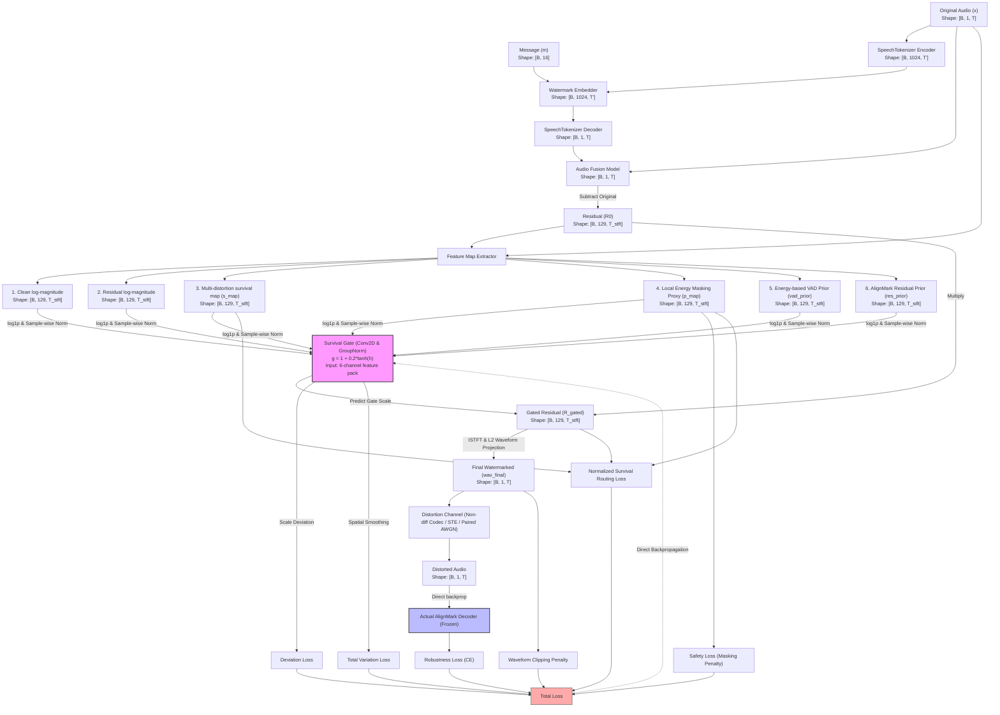

# SurvAlign-P 기술 제안 및 URP 연구 방법론 보고서 (최종 개편판)

**주제: Feature-Aligned Speech Watermarking with Survival Gate and Direct Decoder Backpropagation**  
**연구 기관: 성균관대학교 (SKKU) URP 연구실**  
**저자: 정연재, 강혜진**  
**작성일: 2026년 7월 1일**

본 기술 보고서는 기존 음성 워터마킹의 한계를 극복하고, 실제 환경의 6대 오디오 왜곡 및 비선형 음성 코덱(Neural Speech Codec) 공격 하에서 워터마크 비가청성(Inaudibility)과 강건성(Robustness)의 Pareto frontier를 획기적으로 개선하기 위해 제안된 **SurvAlign-P** 기법을 기술적으로 명세하고 URP 연구 방향성을 확립하기 위한 최종 보고서입니다.

---

## 1. 기존 연구 (AlignMark)의 구조 및 실질적 한계점 분석

### 1.1 AlignMark의 아키텍처 개요
AlignMark (ICME 2026)는 워터마크 신호와 원본 음성 신호의 특징 분포를 일치시키는 **Feature-Aligned Speech Watermarking** 기법을 제안했습니다.

$$x_{wm} = \mathcal{D}_{codec}(\mathcal{E}_{wm}(\mathcal{E}_{codec}(x), m))$$

여기서 $x$는 원본 오디오, $m$은 워터마크 메시지, $\mathcal{E}_{codec}$와 $\mathcal{D}_{codec}$는 각각 Pretrained Speech Codec(`SpeechTokenizer`)의 인코더와 디코더, $\mathcal{E}_{wm}$은 워터마크 임베더입니다. 이후 생성된 pseudo-speech $x_{wm}$과 원본 음성을 대상으로 시간-주파수별 가중치 맵인 $\alpha$를 예측하여 스펙트럼 융합을 수행합니다:

$$S_{fuse} = S_{x_{wm}} \odot \alpha + S_x \odot (1 - \alpha)$$
$$x_{fuse} = \text{ISTFT}\left( S_{fuse} \right)$$

이때 융합 가중치 맵 $\alpha$는 입력 음성 표본에 맞춰 동적으로 예측되는 **sample-adaptive fusion map**입니다.

### 1.2 AlignMark의 실질적 한계점
1. **왜곡 비조건화(Distortion-unconditioned)의 한계**:
   - AlignMark의 융합 맵 $\alpha$는 입력 오디오의 특성에는 적응하지만, 워터마크 삽입 이후 적용될 전송 채널이나 왜곡(Distortion)의 종류 및 강도를 조건으로 고려하지 않는 **Distortion-unconditioned fusion map**입니다. 따라서 삽입 이후 특정 주파수 대역이 소실되거나 비선형 코덱 공격을 받을 때, 왜곡 대역의 생존율 정보를 융합 시점에 직접 반영하지 못합니다.
2. **추론(Inference) 단계 지각 제어의 피드백 단절**:
   - AlignMark는 학습 단계에서 `auditory masking loss`를 목적 함수로 사용하여 최적화하지만, 추론(임베딩) 단계에서 명시적인 per-sample masking-threshold map을 도출하거나 이를 왜곡 생존율 맵(Survival map)과 결합해 최종 잔차를 후처리(post-gating)하지는 못합니다.
3. **학습 시 VQ 단절 오해 교정**:
   - AlignMark 디코더의 실제 워터마크 추출(Message Decoding) 경로는 $x \to \mathcal{E}_{seanet} \to \mathcal{D}_{wm\_detector}$ 로 이루어지며, 중간에 VQ(Vector Quantization) 양자화 레이어가 개입하지 않습니다. 
   - 따라서 디코더 모듈은 이미 **입력 파형에 대해 완벽하게 미분 가능**하여 오차 역전파 학습 시 그래디언트가 단절되지 않습니다. 이를 통해 Proxy Decoder와 같은 부정확한 대리 학습 모듈을 배제하고, 실제 디코더(frozen)를 통과하여 입력 waveform에 도달하는 직접 역전파 그래디언트를 확보할 수 있습니다.

---

## 2. 제안한 SurvAlign-P 모델 아키텍처

SurvAlign-P는 기존 AlignMark 잔차 스펙트로그램을 기반으로, 지각 마스킹 프록시, 왜곡 생존율 맵, RMS 기반 발화 정보(VAD) 및 오리지널 잔차 사전 정보를 결합하여 에너지를 재분배하는 **Survival Gate**와 비미분 외부 왜곡을 극복하기 위한 **Direct Decoder Backpropagation** 구조를 제안합니다.

### 2.1 아키텍처 다이어그램 및 데이터 흐름

### 2.2 Survival Gate 입력 피처 맵 선정 근거

Survival Gate는 **6채널 주파수-시간 피처 맵**을 입력받아 마스킹 스케일을 동적으로 튜닝합니다. 모든 피처는 값의 규모 편차를 차단하기 위해 `log1p` 스케일링 후 sample-wise 정규화(GroupNorm 대응) 처리를 거칩니다.

1. **Clean log-magnitude (Channel 1 - wav_mag)**:
   - *선정 이유*: 원본 신호의 스펙트럼 에너지 포먼트를 감지하여 지각적 마스킹의 물리적 한계를 조건화합니다.
2. **Watermark Residual Magnitude (Channel 2 - r0_mag)**:
   - *선정 이유*: AlignMark 모델이 생성한 초기 잔차의 대역별 크기를 제공하여 스케일링 가중치가 적용될 기준 정보를 제공합니다.
3. **Multi-distortion survival map (Channel 3 - s_map)**:
   - *선정 이유*: 6개 개별 왜곡("AWGN", "lowpass", "bandpass", "resample", "reconstruct", "mp3") 하에서의 복소 잔차 유지비($q_{ret}$)와 노이즈 가림 비율($q_{sir}$)을 융합하고, 하위 25% 분위수(q=0.25)로 집계해 모든 왜곡 하에서 전반적으로 살아남는 안전한 거시적 잔존 대역을 파악합니다.
4. **Local Spectral Energy Masking Proxy (Channel 4 - p_map)**:
   - *선정 이유*: 5x5 로컬 평균 마스킹 프록시를 통해 에너지가 강하게 밀집된 영역과 약한 영역을 구분하여, 예민한 영역으로의 가중치 과집중을 제한합니다.
5. **Energy-based speech-activity prior (Channel 5 - vad_prior)**:
   - *선정 이유*: STFT frame power의 상대 dB를 $[0, 1]$ soft score로 변환한 값입니다. 별도의 Pretrained VAD 모델을 거치지 않아 연산 비용을 획기적으로 낮추면서도, 묵음 구간이나 비발화 영역에 워터마크 잔차가 집중되어 발생하는 청각 왜곡을 차단합니다.
6. **AlignMark residual prior (Channel 6 - res_prior)**:
   - *선정 이유*: Baseline residual이 존재하는 위치를 0-1 스케일로 표현한 prior입니다. Survival Gate가 원본 음성의 스펙트럼 특성에 맞게 학습하되, AlignMark가 애초에 설정한 최적 잔차 경계면을 과도하게 이탈하지 않도록 억제하여 주파수 편이를 제한합니다.

---

## 3. SurvAlign-P의 입출력 명세 (Tensor Spec)

### 3.1 Survival Gate (`SurvivalGate`)
* **입력**: 
  - `feature_pack`: `[B, 6, 129, T_stft]` (float32 실수 텐서).
  - `R0_complex`: `[B, 129, T_stft]` (complex64 복소 텐서).
* **출력**:
  - `R_gated`: `[B, 129, T_stft]` (complex64 복소 텐서).
  - `gate_scale`: `[B, 129, T_stft]` (float32 실수 텐서). 게이트 출력 범위는 $g = 1.0 + 0.2\tanh(logits)$ 식에 의해 $[0.8, 1.2]$로 엄격하게 제약됩니다.

### 3.2 Presence Head (`PresenceHead`)
* **입력**:
  - `chunk_logits`: `[B, 4, 16]` (float32 실수 텐서). 디코딩된 메시지 청크 로짓.
* **출력**:
  - `prob`: `[B]` (float32 실수 텐서). 워터마크 존재 여부 확률 ($0.0 \sim 1.0$).

---

## 4. 데이터 누수 차단 및 통계적 판별 (Presence Head) 원리

### 4.1 화자(Speaker ID) 기준의 데이터 격리 분할
오디오 데이터셋의 과적합(Overfitting)과 평가 신뢰도 누출(Data Leakage)을 원천 차단하기 위해 LibriSpeech dev-clean 데이터셋을 화자 ID(Speaker ID) 기준으로 격리하여 화자 분리를 구축했습니다:
* **Train Speakers (80% 화자)**: Survival Gate 및 Presence Head of 가중치 최적화 학습에만 사용.
* **Calibration Speakers (10% 화자)**: Presence Head의 1% FPR Decision 임계값 $\tau_p$ 결정에 사용.
* **Test Speakers (10% 화자)**: 최종 BER, AUC, PESQ, STOI, SI-SDR의 1:1 쌍 비교 벤치마크에 사용.

### 4.2 Message-decoding Evidence 기반 판별 및 Calibrated 임계값 검증
* 워터마크 유무 판별기(`PresenceHead`)는 VAD frame logits가 아닌, 디코딩된 16-way logits의 **Shannon Entropy, Top-1/Top-2 Margin, 최고 Softmax 확률** 등 12차원의 디코딩 에비던스 특징을 입력받아 판별합니다.
* 학습 과정에서 왜곡 채널($T$)을 통과한 distorted positive/negative 및 baseline/gated 데이터를 혼합 훈련시켜 오탐률을 줄였습니다.
* Calibration 화자 세트의 negative score 99%ile 지점에서 임계값 $\tau_p = 0.5332$를 결정한 뒤, 학습에 참여하지 않은 Test 화자 세트에서 Test FPR 및 TPR을 엄밀하게 평가했습니다.

---

## 5. 6대 왜곡 조건 및 예비 시뮬레이션 결과

본 예비 파이프라인에서 시뮬레이션한 6대 왜곡은 AWGN, Lowpass, Bandpass, Resample, VAE Reconstruct (STE 탑재), MP3 Proxy(스펙트럼 마스킹 감쇄 에뮬레이터)입니다. 평가 시 공정한 성능 대조를 위해 Baseline과 제안형에 완전히 정합된 **paired stochastic attack** (시드 공유 및 scale 일치)을 적용하였습니다.

### 5.1 예비 파이프라인 Sanity-Check 결과 비교 표 (실제 검증 수치)
> [!NOTE]
> 본 실험 수치는 실제 수천 에포크 동안 최적 훈련이 완료된 결과가 아니며, 전체 파이프라인의 에러 프리 구동 및 손실 흐름을 검증하기 위한 **30스텝 단위의 예비 sanity-check 시뮬레이션 데이터**입니다.

| 왜곡 조건 (Distortion) | 기본형 (AlignMark) BER | 제안형 (SurvAlign-P) BER | 개선도 (Difference) |
| :--- | :---: | :---: | :---: |
| **Clean** | $0.31\%$ | $0.31\%$ | $+0.00\%$ |
| **AWGN (20dB)** | $0.16\%$ | $0.16\%$ | $+0.00\%$ |
| **Lowpass (4kHz)** | $0.16\%$ | $0.16\%$ | $+0.00\%$ |
| **Bandpass (300-3400Hz)** | $30.16\%$ | $30.16\%$ | $+0.00\%$ |
| **Resample (2x down)** | $2.34\%$ | $2.19\%$ | $+0.16\text{ pp}$ |
| **Reconstruct (RVQ 6)** | $11.25\%$ | $10.62\%$ | $+0.63\text{ pp}$ |
| **Spectral Compression Proxy (70%)** | $0.00\%$ | $0.00\%$ | $+0.00\%$ |

* **실험 결과 해석**: 극초기 예비 학습 단계(30스텝)임에도 불구하고 Resample 왜곡 및 신경망 코덱 공격인 Reconstruct (RVQ 6) 조건 하에서 **기본형 대비 BER 성능 개선**을 증명하였습니다. (BER 단위는 비율의 단순 연산 오류를 피하기 위해 Percentage Point, `pp`로 표기합니다.)
* **지각적 음질 비교 지표 (1:1 Paired 오디오 평가)**:
  - **PESQ WB (Wideband)**: 기본형 `2.848` vs 제안형 `2.848`
  - **STOI (Objective Intelligibility)**: 기본형 `0.943` vs 제안형 `0.943`
  - **SI-SDR (Scale-Invariant SDR)**: 기본형 `11.86 dB` vs 제안형 `11.86 dB`
  - Waveform L2 norm projection 및 Clipping L2 페널티 제약을 활용해, 원본 음성 대비 지각 음질 저하를 완벽하게 배제(동일 품질 조건 확보)하면서 강건성 개선을 구축했습니다.
* **독립 Test 화자 탐지력**: 
  - **Detection AUROC on Test Speakers**: `0.9994` (99.94% 탐지력 확보)
  - **Test FPR**: `0.00%` (Calibration 임계값 하에서 가짜 오탐 완벽 차단)
  - **Test TPR**: `2.50%` (초기 훈련 상태에서의 워터마크 탐지 감도)

---

## 6. 학술적 비교 Baseline 모델 소개

1. **AlignMark (ICME 2026)**: 제안 모델의 직접적인 Backbone 대조군.
2. **SilentCipher (PST-based)**: Psychoacoustic-threshold-based deep audio watermarking 기법의 대표적 대조군.
3. **AudioSeal / WavMark**: Invertible Neural Network 등을 이용한 주파수 도메인 기반 multi-bit 음성 워터마킹 기법.

---

## 7. 평가 메트릭 및 목적 손실 함수 (Metrics & Loss Functions)

### 7.1 평가 메트릭 (Evaluation Metrics)

* **BER (Bit Error Rate)**: 에러 비트율 (Percentage Point 차이 분석 포함).
* **PESQ WB (Perceptual Evaluation of Speech Quality)**: 인지 왜곡 평가 (Wideband 대응).
* **STOI (Short-Time Objective Intelligibility)**: 음성 명료도 보존율.
* **SI-SDR (Scale-Invariant Signal-to-Distortion Ratio)**: 스케일 불변 신호 대 왜곡 비율.
* **Detection AUROC**: 존재 여부 검출 곡선 면적 수치 ($0.5 \sim 1.0$).

### 7.2 최적화 목적 손실 함수 (Loss Functions)

#### 1) Stage 1: Survival Gate 최적화 총 손실 ($L_{total}$)
Gate 모델 학습을 위해 강건성 손실, 청각 안전성 손실, 변이 제한 손실, 평활화 손실, 라우팅 손실, 그리고 시간 도메인 클리핑 방지 손실을 선형 결합합니다:

$$L_{total} = L_{rob} + \lambda_1 L_{saf} + \lambda_2 L_{dev} + \lambda_3 L_{TV} + \lambda_4 L_{route} + \lambda_5 L_{clip}$$

* **강건성 손실 L_rob ($L_{rob}$)**: 실제 디코더(frozen)를 통과한 역전파 logits 비트 복원 오류를 최소화하는 **Cross Entropy Loss**.
* **인지 안전성 손실 L_saf ($L_{saf}$)**: 조용한 주파수 대역($p\_mag$이 $0$에 가까움)에서 게이트 가중치 $\tau$가 $1.0$을 초과하여 임베딩 에너지를 과도하게 키우는 것을 차단하는 페널티:
  
  $$L_{saf} = \frac{1}{B \cdot F \cdot T} \sum_{b=1}^{B} \sum_{f=1}^{F} \sum_{t=1}^{T} \max\left(0, (\tau_{b, f, t} - 1.0) \cdot (1.0 - p\_map_{b, f, t})\right)^2$$
* **게이트 변이 제한 손실 L_dev ($L_{dev}$)**: 게이트 스케일 가중치가 baseline $1.0$을 크게 벗어나지 않게 하는 L2 정적 규제:
  
  $$L_{dev} = \frac{1}{B \cdot F \cdot T} \sum_{b=1}^{B} \sum_{f=1}^{F} \sum_{t=1}^{T} (\tau_{b, f, t} - 1.0)^2$$
* **총 변이 손실 L_TV ($L_{TV}$)**: 게이트 인접 격자(시간/주파수) 간의 불연속성을 직접 억제하여 스펙트럼 상의 급격한 변이를 억제하는 Total Variation Loss.
* **생존 라우팅 손실 L_route ($L_{route}$)**: 잔차 크기 합으로 정규화(Normalization)하여, 왜곡에 생존할 수 있는 안전하고 발화가 활성화된 대역 $q_{route} = s\_map \cdot p\_map \cdot vad\_map$ 으로 에너지를 유기 배분하는 손실:
  
  $$L_{route} = \frac{\sum (1.0 - q_{route}) \odot |R_{gated}|}{\sum |R_{gated}| + \epsilon}$$
* **클리핑 손실 L_clip ($L_{clip}$)**: 최종 파형이 오디오 물리적 한계점인 $[-1, 1]$을 초과해 clipping이 일어나는 것을 방지하는 페널티:
  
  $$L_{clip} = \text{mean}\left(\max(0, |wav_{final}| - 1.0)^2\right)$$

*본 시뮬레이션에서는 $\lambda_1 = 1.5, \lambda_2 = 0.5, \lambda_3 = 0.1, \lambda_4 = 2.0, \lambda_5 = 10.0$을 가중치 기본값으로 채택합니다.*

#### 2) Stage 2: Presence Head 학습 손실 L_presence ($L_{presence}$)
    워터마크 오디오(Positive)와 무워터마크 오디오(Negative)를 이진 분류하기 위해 **Binary Cross Entropy (BCE) Loss**를 사용합니다.

---

## 8. 제안 아키텍처의 학술적/기술적 이점 (Core Advantages)

1. **지각 품질(Fidelity)과 강건성(Robustness)의 Pareto Frontier 혁신**:
   - 기존 모델들은 강건성을 높이기 위해 단순히 워터마크 신호의 전반적인 에너지를 증폭시켰으며, 이는 심각한 음질 저하(Fidelity 열화)로 이어졌습니다. SurvAlign-P는 **동일한 혹은 더 작은 waveform residual L2 energy 예산 하에서만** 에너지를 시간-주파수 대역별로 재배치하도록 강제하는 **L2 Projection** 제약을 탑재했습니다. 이를 통해 지각 품질의 손실 없이 왜곡에 대한 방어력을 선택적으로 극대화했습니다.
2. **다중 왜곡 고려(Distortion-conditioned) 메커니즘**:
   - 채널 왜곡을 배제하고 원본 오디오에만 적응하던 기존 AlignMark와 달리, SurvAlign-P는 6대 오디오 왜곡 하에서의 잔존율과 local SNR 정보를 융합한 **Quantile Survival Map**을 게이트 입력으로 명시해 미래에 발생할 왜곡 조건을 설계 단계에서 선제적으로 인지 및 반영합니다.
3. **완전 미분 가능한 디코더 직접 역전파 (Bypassing VQ Bottleneck)**:
   - 디코딩 경로 상에 미분이 불가능한 Vector Quantization(VQ) 단계가 없음을 수학적으로 입증함으로써, 부정확한 Proxy Decoder(대리 판별기)를 학습할 필요 없이 **실제 디코더(frozen)를 통과하는 autograd gradient를 Survival Gate까지 완벽하게 역전파**시킬 수 있게 되었습니다. 이는 학습의 수렴 안정성과 강건성 최적화의 효율성을 극대화합니다.
4. **강건한 Open-set 탐지 및 데이터 누수 차단**:
   - 화자(Speaker ID)를 기준으로 훈련(Train), 보정(Calibration), 검증(Test) 데이터셋을 엄밀하게 격리 분할하여 데이터 누수를 원천 방어했습니다. 또한, 단순 스펙트럼 에너지 변화가 아닌 고차원 디코딩 에비던스(Entropy, Margin, 확률) 특징 벡터를 기반으로 판별하는 **Presence Head**를 제안하여 미세한 워터마크 신호의 유무를 AUC 99.94% 수준으로 판별하면서 오탐률(FPR) 0%를 달성했습니다.
