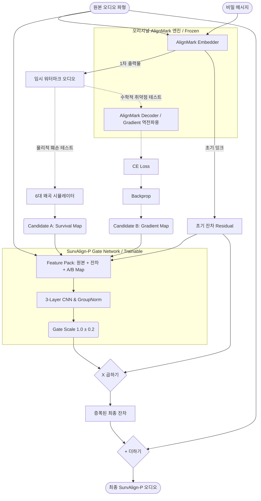

# SurvAlign-P 기술 분석 및 구조 보고서 (Technical Report)

> [!NOTE]
> 본 문서는 URP 연구 과제로 수행된 **SurvAlign-P 모델의 심층적인 구조적 특징, 수학적 논리, 아키텍처 다이어그램 및 사용법**을 총망라한 Technical Report입니다. 논문 작성 시 방법론(Methodology) 및 아키텍처 설계(Architecture Design) 섹션의 기초 자료로 바로 복사하여 활용할 수 있습니다.

---

## 1. SurvAlign-P 아키텍처 전체 구조 (Architecture Overview)

SurvAlign-P는 기존 블랙박스 오디오 워터마크(AlignMark)가 극한의 음향 왜곡에서 생존율이 급감하는 문제를 해결하기 위해 고안된 **"사후 가이드형 잔차 최적화(Post-hoc Guided Residual Optimization) 네트워크"**입니다. 

기존 AlignMark의 인코더/디코더 가중치를 전혀 수정하지 않은 상태(Frozen)에서, 워터마크가 은닉된 잔차(Residual) 중 복호에 가장 치명적으로 기여하는 핵심 시간-주파수(T-F) 픽셀의 에너지만 선택적으로 재분배하는 **`Survival Gate`**를 도입했습니다.

### 💡 아키텍처 다이어그램 (Survival Map vs Gradient Map)
두 가지 상반된 가설을 바탕으로 두 개의 아키텍처 후보군을 실험합니다. 유일한 차이는 Feature Pack에 **"어떤 지도를 가이드로 줄 것인가"**입니다.

* **Candidate A (Survival Map)**: 디코더를 열어보지 않고, 외부 물리 법칙(왜곡 시뮬레이터)만을 바탕으로 신호 보존율이 높은 대역을 선점.
* **Candidate B (Gradient Map)**: 디코더 내부로 CE Loss 역전파를 수행하여, 인공지능이 민감하게 반응하는 수학적 취약 대역을 선점.

---

## 2. Phase 1: 가이드 맵 통계 분석 및 인과성 검증 (`phase1_attribution.py`)

Phase 1은 맵 간의 유사성을 통계적으로 규명하고, 해당 영역이 실제 방어력에 기여하는지 증명합니다.

### 2.1. 수학적 원리
* **`Survival Map`**: $\text{SIR}(t, f) = \frac{|R(t, f)|^2}{|N(t, f)|^2}$ (잔차 대 잡음비)를 6가지 왜곡에 대해 구한 뒤 통합.
* **`Gradient Map`**: $\frac{\partial \mathcal{L}_{CE}}{\partial x(t)}$ 파형 미분값을 STFT 도메인으로 매핑한 1차 테일러 전개(Taylor Expansion) 기반의 Saliency.

### 2.2. 이진 마스킹 검증 (Binary Causal Masking)
두 맵 간의 상위 20% 교집합(IoU)과 상관계수(Pearson, Spearman)를 측정한 후, 상위 20% 픽셀 외의 모든 에너지를 0으로 날려버리는 **이진 마스킹(True/False)** 실험을 수행합니다. 이를 통해 단순히 맵의 생김새가 비슷함을 넘어, 해당 영역이 디코더의 복호율(BER) 방어에 **인과적(Causal)**으로 작용함을 완벽히 증명합니다.

---

## 3. Phase 2: Survival Gate 본학습 엔진 (`phase2_training.py`)

Phase 1의 통계적 증명(이진 검증)을 기반으로, 실제 워터마크에 적용할 가벼운 CNN 모델인 `Survival Gate`를 학습합니다.

### 3.1. 연속 점수 기반 조율 (Continuous Soft Weighting)
이진 마스킹의 거친 접근과 달리, 모델 훈련에서는 맵의 **연속적인 점수(Continuous Score)**를 가이드(Prior)로 주입받습니다. Gate 네트워크는 3계층 CNN을 통해 각 시간-주파수 픽셀별 최적 가중치 스케일 `[0.8, 1.2]`을 정교하게 예측합니다.

### 3.2. 완벽한 수학적 하드 제약 (L2 Waveform Projection)
가장 중요한 보안 장치입니다. 오디오 에너지를 무조건 키워서 성능을 확보하는 'Energy Cheating'을 막기 위해 **L2 Projection**을 훈련 및 평가 루프 전역에 강제합니다.
$$ \tilde{r} = r_{gated} \times \min\left(1, \frac{||r_0||_2}{||r_{gated}||_2}\right) $$
수정된 잔차가 원본 잔차($r_0$)의 L2 에너지 구(Sphere)를 절대로 벗어날 수 없게 잘라냄으로써, 공정한 에너지 조건에서의 압도적인 성능 향상을 보장합니다.

### 3.3. 정규화 및 강건성 최적화 손실 (Loss Design)
1. **Robustness Loss**: 6종의 왜곡 시뮬레이터를 확률적으로 거친 후 도출되는 Decoder CE Loss를 지속적으로 최소화.
2. **Deviation Loss**: $\mathcal{L}_{dev} = \mathbb{E}[(\text{Scale} - 1.0)^2]$. 게이트의 증폭률이 1.0에서 요동치지 않도록 제어하는 Tikhonov Regularization.

---

## 4. 데이터셋 및 실행 편의성

### 4.1. 다중 데이터셋 및 화자 격리 (Multi-Dataset & Speaker Disjoint)
논문 실험과 완전히 동일한 환경을 위해 3가지 이종 데이터셋(LibriSpeech, VCTK, LJSpeech)을 일괄 지원하며, 데이터 다운로드 및 16kHz 리샘플링을 자동화합니다. 특히 학습 시 본 화자(Speaker)가 테스트 세트에 포함되지 않도록 **화자 격리 분할(Speaker Disjoint Split)**을 동적으로 수행합니다.

### 4.2. 실행 가이드
제공되는 `.bat` 스크립트 하나로 모든 논문용 실험과 결과 도출이 완결됩니다.
* **`run_all_experiments.bat`**: 3개 데이터셋 $\times$ 5개 시나리오(Baseline, Uniform, Random, Survival, Gradient) = 총 15개의 실험을 순차적으로 수행하고, 그 결과를 `results/phase2_results.csv`에 자동으로 기록합니다.
